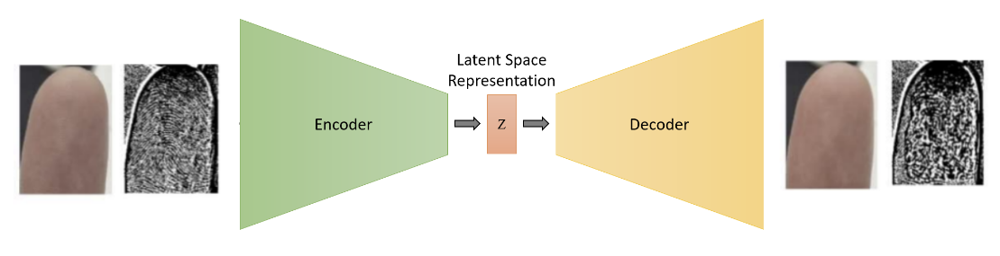
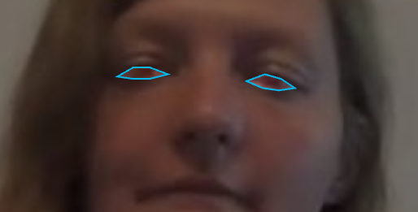

# Save Your Biometric Information

### Project explanation
The important of cameras in our society is increasing as the demand for Online Education, Video Conference, or SNS increases.   
But resents high resolution cameras accidentally expose our important biometric information such as  fingerprints or iris.  
Exposed fingerprints can easily be copied and can pass electric security.  
So, we propose to manipulate biometric information automatically that enhance people’s biometric security.    

### Related paper & news
**Paper**  
Real-Time Flying Object Detection with YOLOv8, 2023, Object Detection/Segmentation/Classification, Configurable for fast and simple architecture for localizing fingerprints and iris in pixel level. Unlike Hand keypoint approach, it demands lots of fingerprint and iris data to train model.

U-Net: Convolutional Networks for Biomedical Image Segmentation, 2015, Autoencoder, Can manipulate images' detailed information such as fingerprint without making discomfort of human vision. It doesn't conside

 

### Our approach
We propose to manipulate biometric information automatically that enhance people’s biometric security.  
We use Yolov8n Instance Segmentation model to detect iris and fingerprints.  
And we use Auto Encoder model to destroy fingerprint and iris.    

 

## Proposed model

### Step 1: Labeling & Annotating iris and fingerprints
Labeling & Annotating fingertip and iris from selfie dataset with instance segmentation format.

### Step 2: Train Yolov8n Instance Segmentation
Train Yolov8 nano model instance segmentation model with dataset we made at Step 1.

### Step 3: Train Auto Encoder Model
Train Auto Encoder Architecture model with Identity Loss to make model reconstruct input image as same as they can. Nature of Auto Encoder architecture will destroy subtle feature like fingerprint.

### Result (= Output image)
We can check that fingerprint is efficiently destroyed without making discomfort to the human eye.

  

## Using Dataset

We used Microsoft's [ASL Citizen](https://www.microsoft.com/en-us/research/project/asl-citizen/dataset-description/) the first crowdsourced isolated sign language video dataset for training Yolov8n model.  

  

 

**Add**

  

## Experiment

How we performed experiments 

 

**Add**

  

## Total result

Result of our project

 

**Add**

  

     

***

#### Previous version

[Check previous version](Fingerprint.md)

