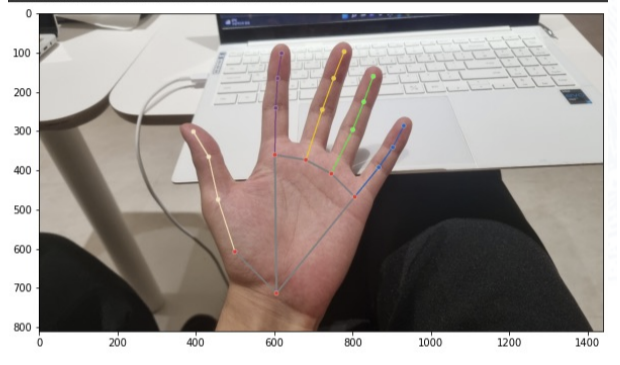
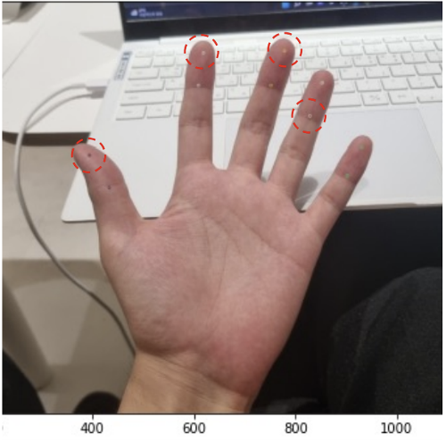
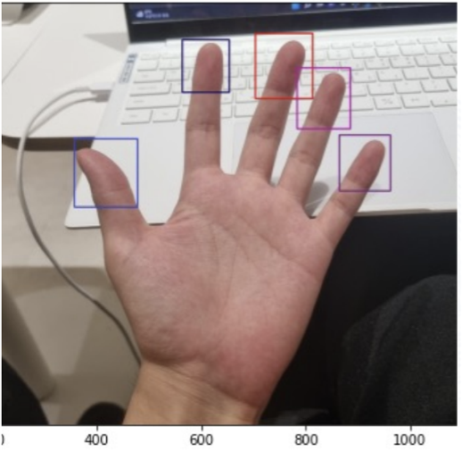
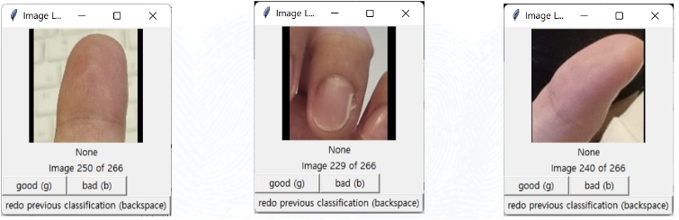
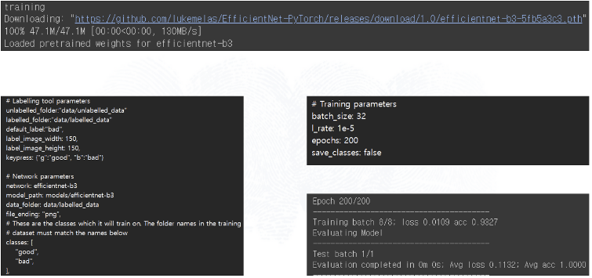
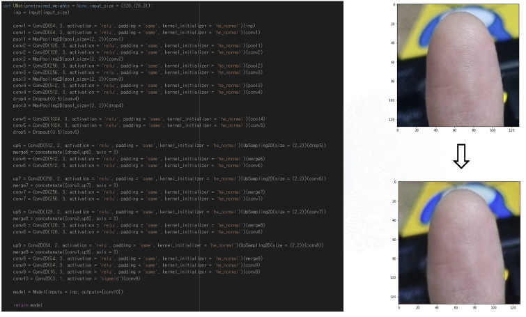
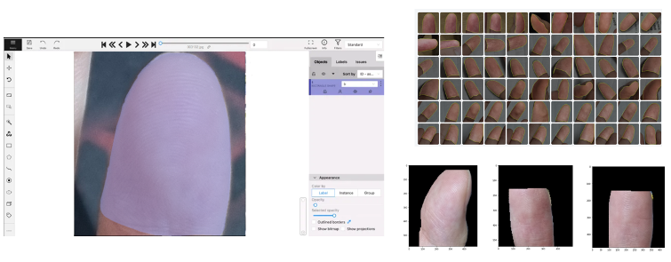
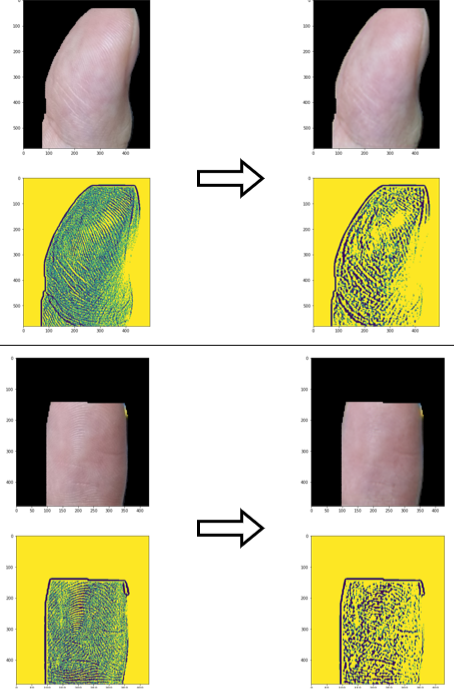
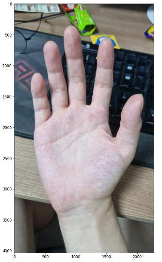
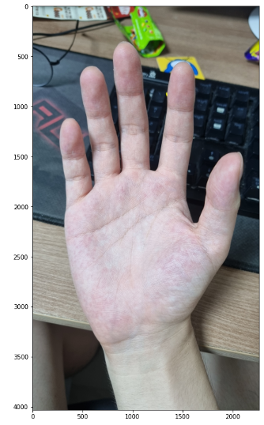

# Your-fingerprints-are-precious

## Project explanation

Because of Covid-19, our society changes to use more cameras through distance education, Video Conference or SNS. But resents high resolution cameras accidentally expose our important biometric information, fingerprint.  Exposed fingerprints can easily be copied and can pass electric security. So, we propose to manipulate fingerprints automatically that enhance people’s biometric security.

 

## Project process

### Step 1: crop fingertip

1. Get hand key-points with Mediapipe

  

2. bring distal phalanges from hand key-points to get fingerprints

  

3. extend the fingertip position to the end of the finger.

  

4. Get end of the finger and distal phalanges vector to calculate orthogonal vectors, and get coordinate of the box.

 

  

### Step 2: Label cropped fingertip
 

  

### Step 3: Train efficientNet for predicting whether fingerprint is exposed or not

  

### Step 4 : Train Auto-Encoder with U-net architecture to manipulate fingerprint

  

### Step 5 : Annotate fingerprint and training segmentation model

After apply those models appropriately, the result is below.

   

## Result

#### Before

 

#### After

